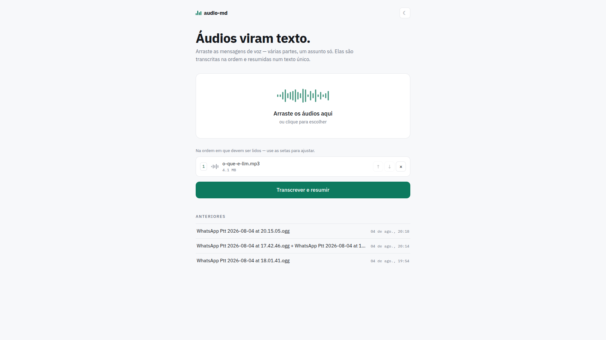
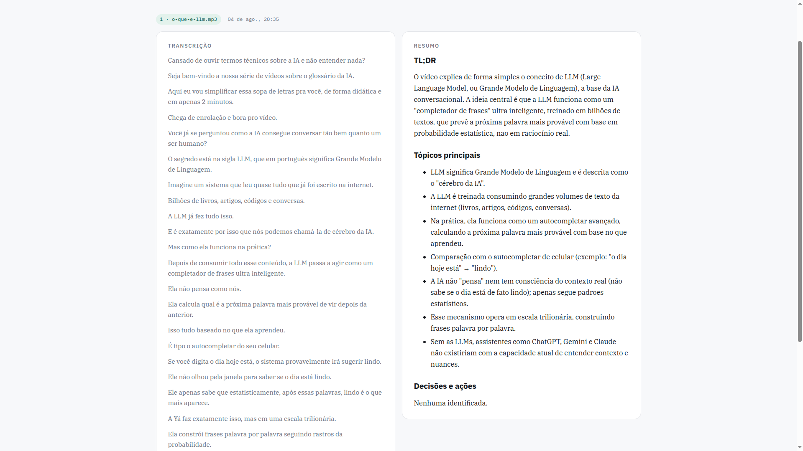

# audio-md

Transcreve arquivos de áudio, vídeos locais ou **vídeos do YouTube** e destila o
conteúdo em um resumo Markdown. A pasta de saída é um trecho curto do **SHA-256**
do arquivo (ou o **id do vídeo** no YouTube), então a mesma entrada nunca é
reprocessada.





```
arquivo de áudio ->  ./outputs/audios/{hash-curto}/transcript.txt
                     ./outputs/audios/{hash-curto}/summary.md
                     ./outputs/audios/{hash-curto}/meta.json   # inclui o sha256 completo

URL do YouTube   ->  ./outputs/youtube/{video-id}/transcript.txt
                     ./outputs/youtube/{video-id}/summary.md
                     ./outputs/youtube/{video-id}/meta.json    # inclui título/canal/url
```

- **Download do YouTube:** [`yt-dlp`](https://github.com/yt-dlp/yt-dlp) — só o
  stream de áudio, em um diretório temporário apagado após a transcrição.
- **Transcrição:** [`faster-whisper`](https://github.com/SYSTRAN/faster-whisper)
  (GPU, com fallback automático para CPU).
- **Resumo:** um agent CLI headless — `claude`, `opencode` ou `codex` — sem API
  key para gerenciar (cada um usa o próprio login).

---

## Como funciona

1. **Identifica** a entrada: arquivo de áudio é hasheado (SHA-256; os 8 primeiros
   caracteres nomeiam a pasta de saída); URL/id do YouTube usa o id do vídeo como
   nome da pasta. Nos dois casos, transcrição em cache pula direto para o resumo —
   áudio do YouTube nem chega a ser baixado de novo.
2. **Transcreve** com faster-whisper (GPU, caindo para CPU automaticamente), com
   barra de progresso sobre a linha do tempo do áudio.
3. **Resume** a transcrição em `summary.md` com o agent CLI escolhido
   (`claude`/`opencode`/`codex`).

Cada etapa imprime um cabeçalho `▸`, então dá para saber sempre onde a execução está.

---

## Instalação

Requer **Python ≥ 3.12**, [uv](https://docs.astral.sh/uv/), `ffmpeg`, Node ≥ 22
(para YouTube) e — para o
resumo — um agent CLI logado: o [`claude` CLI](https://claude.com/claude-code)
(`claude login`), `opencode` ou `codex`.

```bash
uv sync --extra transcribe                 # só CPU: faster-whisper + CTranslate2
uv sync --extra transcribe --extra gpu     # + aceleração GPU (NVIDIA, recomendado)
```

(ou `make deps` — GPU por padrão; `make deps EXTRAS="--extra transcribe"` para só CPU)

`--extra transcribe` traz faster-whisper + CTranslate2. Sem ele o pacote ainda
roda, mas a transcrição falha até que seja instalado.

O YouTube usa `yt-dlp[default]`, incluindo `yt-dlp-ejs` para os desafios
JavaScript. Se o Node estiver no NVM, configure seu caminho absoluto no `.env`
para que o serviço também consiga executá-lo:

```dotenv
YOUTUBE_NODE_PATH=/home/seu-usuario/.nvm/versions/node/v24.17.0/bin/node
```

Use o caminho retornado por `command -v node`; atualize-o se remover essa versão
do NVM. Sem configuração explícita, procura Node (ou Deno) no PATH. O Docker já
inclui Node 22 e o Compose usa seu caminho interno, ignorando o caminho do host.
Em HTTP 403, o download extrai URLs novas e tenta mais uma vez. Se persistir,
o erro identifica o vídeo; cookies do navegador não são importados automaticamente.

Para instalar como comando standalone (e largar o prefixo `uv run`):

```bash
uv tool install '.[transcribe,gpu]'
audio-md --help
```

### GPU (recomendado na RTX 4050)

O extra `gpu` embute as bibliotecas CUDA de que o CTranslate2 precisa (cuDNN 9 +
cuBLAS 12). Elas são **pré-carregadas automaticamente** em runtime, então não há
`LD_LIBRARY_PATH` para configurar — basta instalar o extra e a GPU é usada.

O device é escolhido por `WHISPER_DEVICE` (ou `--device`):

- `auto` (padrão) — tenta a GPU e cai para a CPU se falhar.
- `cuda` — força a GPU (dá erro se não conseguir, em vez de usar a CPU em silêncio).
- `cpu` — força a CPU.

O `meta.json` registra o `device` realmente usado, para conferir se a GPU rodou.
O `large-v3` com `int8_float16` usa ~3 GB de VRAM (cabe em 6 GB). Em máquinas mais
fracas use `--model medium` ou `--model small`, ou troque precisão por velocidade
com `--beam-size 1`.

---

## Docker (alternativa rápida)

Para rodar sem instalar `uv`, `ffmpeg` e whisper no host. Precisa só de Docker com
Compose — nada da seção de instalação acima se aplica aqui.

```bash
make docker-up      # constrói e sobe → http://127.0.0.1:8765
make docker-login   # uma vez: login do CLI que gera o resumo
```

O dia a dia: `make docker-logs`, `make docker-down` e
`make docker-cli ARGS="/app/inputs/a.mp3"` para o CLI (arquivos colocados em `inputs/`).

- **GPU é automática.** A mesma imagem serve as duas máquinas: se o Docker expõe o
  runtime nvidia, o `make docker-up` liga a GPU sozinho; se não, transcreve na CPU.
- **Sem GPU, troque o modelo.** O padrão `large-v3` é pesado demais na CPU — use
  `WHISPER_MODEL=small` no `.env`.
- **Configuração é o mesmo `.env`.** O Compose fixa `YOUTUBE_NODE_PATH` para o Node
  interno. Há também duas configurações que o compose declara por conta
  própria (o `environment` tem precedência sobre o `env_file`): a **porta** — dentro do
  container o app escuta sempre em 8765, e quem escolhe a porta publicada no host é
  `HOST_PORT`, justamente para um `WEB_PORT=80` não fazer o processo não-root tentar
  bindar porta privilegiada (com `HOST_PORT=80`, o `audio-md.local` funciona sem o
  nginx); e o **device** — `WHISPER_DEVICE` é `cpu` por padrão e vira `auto` quando o
  `make docker-up` detecta a GPU.
- **Os arquivos saem com o seu usuário.** O `make docker-up` passa o seu uid/gid para o
  build em `APP_UID`/`APP_GID` — e não em `UID`/`GID`, que são readonly em bash e zsh —
  para `outputs/` não ficar de root.
- **O login fica separado do seu.** O container tem o próprio diretório de
  credenciais (volume `audio-md_claude-auth`); o `claude` do host não é tocado.

`outputs/` é compartilhado com o host, então o cache de transcrição vale para os
dois caminhos.

---

## Uso (CLI)

```bash
uv run audio-md caminho/do/audio.mp3
uv run audio-md "https://www.youtube.com/watch?v=awdC4RZdT8A"   # URL do YouTube
uv run audio-md awdC4RZdT8A                                     # ou só o id do vídeo
uv run audio-md audio.wav --model medium --lang pt
uv run audio-md audio.ogg --no-summary      # só a transcrição
uv run audio-md audio.mp3 --force           # ignora o cache (YouTube: baixa de novo também)

# escolhendo o CLI de resumo:
uv run audio-md audio.mp3 --provider claude-cli --summary-model opus
uv run audio-md audio.mp3 --provider codex-cli  --summary-model gpt-5.5
uv run audio-md audio.mp3 --provider opencode   --summary-model anthropic/claude-sonnet-4-5
```

Opções: `--model` (whisper), `--device` (auto/cuda/cpu), `--beam-size`,
`--batch-size`, `--lang` (vazio = auto-detecta), `--provider`
(claude-cli/opencode/codex-cli), `--summary-model`, `--no-summary`, `--force`,
`--outdir`. Variáveis de ambiente equivalentes no `.env` (veja `.env.example`).

Também roda como módulo: `uv run python -m audio_md audio.mp3`.

---

## Interface web

```bash
make run          # ou: uv run audio-md-web → http://127.0.0.1:8765
```

Arraste arquivos de áudio e vídeo como **um grupo só** (pense nos áudios picotados
do WhatsApp sobre o mesmo assunto), ajuste a ordem e receba uma transcrição
juntada + um único resumo, lado a lado. Os grupos ficam em
`outputs/groups/{hash-do-grupo}/` e servem de histórico do site; as transcrições
por arquivo compartilham o cache do CLI em `outputs/audios/`, nos dois sentidos.
A configuração vem do `.env` (a UI não tem opções).

No bloco **Adicionar conteúdo**, arraste áudios e vídeos ou use **Selecionar
arquivos**. Cole **links do YouTube, um por linha**, e use **Adicionar links**
para organizá-los na mesma lista. Você também pode clicar diretamente em
**Transcrever e resumir**: links ainda no campo são incluídos ao final da lista.

A lista identifica cada fonte, permite ajustar a ordem e mostra o tamanho total
dos arquivos. Links inválidos são indicados por linha antes do envio; arquivos
não aceitos são identificados pelo nome. Acima de **1 GiB** em arquivos, o envio
fica bloqueado até remover itens (o servidor também verifica o tamanho completo
da requisição). Falhas de envio preservam a lista para tentar novamente.
Todos os itens geram uma transcrição combinada e um resumo único. O cache por vídeo fica em `outputs/youtube/{video-id}/`
e é compartilhado com o CLI. Grupos com vários itens e vídeos identificam cada
fonte na transcrição enviada ao resumo.

Vídeos locais (MP4, MOV, MKV, WebM e outros containers compatíveis) usam somente
a primeira faixa de áudio via PyAV/faster-whisper; imagens não são transcritas
e não há conversão intermediária em disco. Mídia corrompida, vazia ou sem áudio
gera erro específico. O limite total de arquivos por envio continua em **1 GiB**.
O CLI também aceita vídeo local: `uv run audio-md video.mp4`.

Se um item falhar, o grupo para e **não gera resumo parcial**. As transcrições
concluídas ficam em cache. Volte à fila e reenvie para tentar novamente, inclusive
se apenas o resumo falhar. A fila permanece enquanto a página estiver aberta;
após recarregá-la, adicione novamente os arquivos e links. Use **Limpar fila**
para começar outro grupo.

API: `POST /api/jobs` aceita multipart com `files` e `items` (JSON ordenado), por
exemplo `[{"type":"youtube","url":"https://youtu.be/OKKSUpDTfXQ"},
{"type":"file","file_index":0}]`. Cada upload precisa aparecer uma vez no
manifesto; URLs e índices são validados antes de enfileirar. Envios antigos com
apenas `url` ou `files` continuam funcionando. Playlists não são expandidas.

### Rodando como serviço (systemd)

Mantém o `audio-md-web` sempre no ar como serviço **user-level** do systemd:
instala e gerencia sem sudo, roda com o seu usuário (GPU e login do `claude`
funcionam normalmente) e reinicia sozinho se cair.

```bash
make install
```

Isso roda `uv sync` com os extras de GPU, renderiza `audio-md.service` com o
caminho do repositório para `~/.config/systemd/user/` e ativa o serviço.

Para o serviço subir no boot **sem precisar de login** (o `make install` tenta,
mas normalmente exige sudo):

```bash
sudo loginctl enable-linger $USER
```

### Domínio local (audio-md.local)

A porta padrão é **8765** — para mudar, defina `WEB_PORT=` no `.env` e rode
`make restart`. Aponte o domínio para o loopback:

```bash
echo "127.0.0.1 audio-md.local" | sudo tee -a /etc/hosts
```

→ **http://audio-md.local:8765**

`/etc/hosts` só resolve nome → IP, não mapeia porta. Para acessar **sem** a
porta (**http://audio-md.local**), use o proxy nginx incluído no repositório
(`audio-md.nginx.conf` — repassa a porta 80 para a 8765, com
`client_max_body_size 1g` para os uploads não esbarrarem no limite do nginx):

```bash
sudo cp audio-md.nginx.conf /etc/nginx/sites-available/audio-md.local
sudo ln -sf ../sites-available/audio-md.local /etc/nginx/sites-enabled/audio-md.local
sudo nginx -t && sudo systemctl reload nginx
```

### Operação

| comando                           | faz                                   |
| --------------------------------- | ------------------------------------- |
| `make status`                     | estado do serviço                     |
| `make logs`                       | segue os logs (journalctl)            |
| `make start` / `stop` / `restart` | controla o serviço                    |
| `make run`                        | roda em foreground (desenvolvimento)  |
| `make uninstall`                  | para, desativa e remove o serviço     |

Notas:

- O resumo usa o agent CLI configurado no `.env` (`claude` por padrão); ele
  precisa estar **logado no mesmo usuário** que roda o serviço. O unit já põe
  `~/.local/bin` e `~/.opencode/bin` no PATH.
- O servidor escuta só em `127.0.0.1` — nada é exposto para a rede.
- Depois de editar o `.env` (modelo whisper, device, provider, porta),
  `make restart`.

---

## Layout

```
src/audio_md/
  cli.py          # argparse + entry point (arquivo vs YouTube)
  config.py       # Settings (args + .env)
  console.py      # saída rich — único escritor no terminal (etapas + barra de progresso)
  hashing.py      # sha256 em streaming
  youtube.py      # parsing de video-id + download só de áudio (yt-dlp)
  transcribe.py   # faster-whisper (GPU/CPU)
  providers.py    # agent CLIs de resumo (claude/opencode/codex, headless)
  summarize.py    # prompt + despacho de provider
  pipeline.py     # hash/download → transcrição → resumo
  web.py          # UI web local (Flask): grupos ordenados → transcrição juntada + um resumo
  static/         # frontend da dropzone (sem build; marked + DOMPurify vendorizados)
```

## Notas

- Formatos: qualquer coisa que o `ffmpeg` decodifique (mp3, wav, ogg, m4a, ...).
- O `meta.json` registra o modelo whisper, o idioma detectado, a duração, o tempo
  de transcrição e o provider/modelo usado no resumo.
